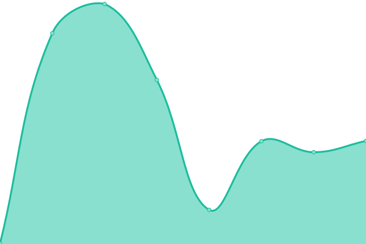
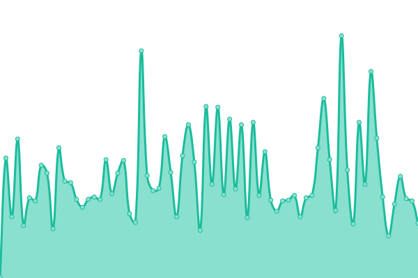

# [📈 Live Status](https://nndvn.github.io/sts): <!--live status--> **🟧 Partial outage**

This repository contains the open-source uptime monitor and status page for [NND](https://nndvn.github.io/sts), powered by [Upptime](https://github.com/upptime/upptime).

With [Upptime](https://upptime.js.org), you can get your own unlimited and free uptime monitor and status page, powered entirely by a GitHub repository. We use [Issues](https://github.com/nndvn/sts/issues) as incident reports, [Actions](https://github.com/nndvn/sts/actions) as uptime monitors, and [Pages](https://nndvn.github.io/sts) for the status page.

<!--start: status pages-->
<!-- This summary is generated by Upptime (https://github.com/upptime/upptime) -->
<!-- Do not edit this manually, your changes will be overwritten -->
<!-- prettier-ignore -->
| URL | Status | History | Response Time | Uptime |
| --- | ------ | ------- | ------------- | ------ |
|  [Ha Manh Thang](https://hamanhthang.com) | 🟩 Up | [ha-manh-thang.yml](https://github.com/nndvn/sts/commits/HEAD/history/ha-manh-thang.yml) | 

 488ms
     
 | 

<a href="https://nndvn.github.io/sts/history/ha-manh-thang">100.00%</a>
    

|  [DHS](https://dhs.vn) | 🟩 Up | [dhs.yml](https://github.com/nndvn/sts/commits/HEAD/history/dhs.yml) | 

 509ms
     
 | 

<a href="https://nndvn.github.io/sts/history/dhs">100.00%</a>
    

|  [Trace Travel Vietnam](https://tracetravelvietnam.com) | 🟥 Down | [trace-travel-vietnam.yml](https://github.com/nndvn/sts/commits/HEAD/history/trace-travel-vietnam.yml) | 

 135ms
     
 | 

<a href="https://nndvn.github.io/sts/history/trace-travel-vietnam">100.00%</a>
    

|  [Son Tung Nguyen](https://sontungnguyen.com) | 🟩 Up | [son-tung-nguyen.yml](https://github.com/nndvn/sts/commits/HEAD/history/son-tung-nguyen.yml) | 

 169ms
     
 | 

<a href="https://nndvn.github.io/sts/history/son-tung-nguyen">100.00%</a>
    

<!--end: status pages-->

[**Visit our status website →**](https://nndvn.github.io/sts)

## 📄 License

- Powered by: [Upptime](https://github.com/upptime/upptime)
- Code: [MIT](./LICENSE) © [Anand Chowdhary](https://anandchowdhary.com), supported by [Pabio](https://pabio.com)
- Data in the `./history` directory: [Open Database License](https://opendatacommons.org/licenses/odbl/1-0/)
